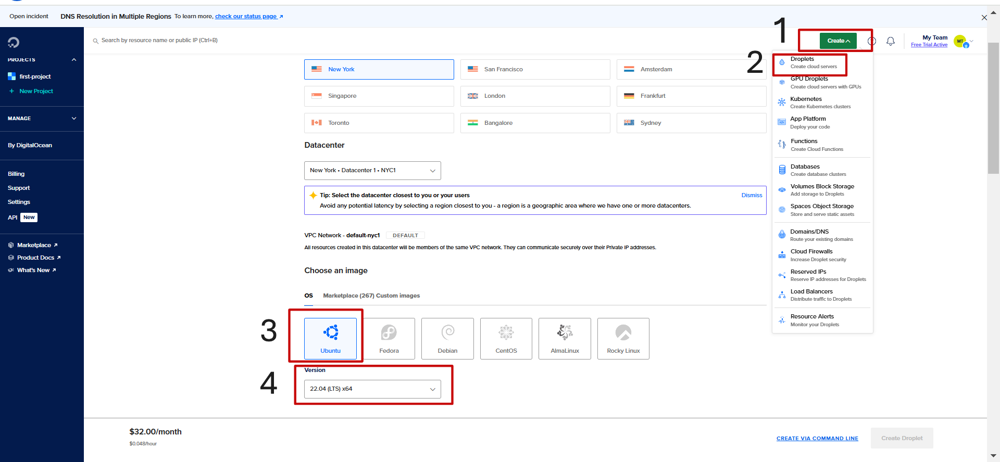
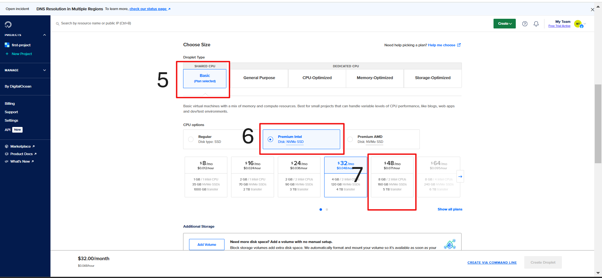
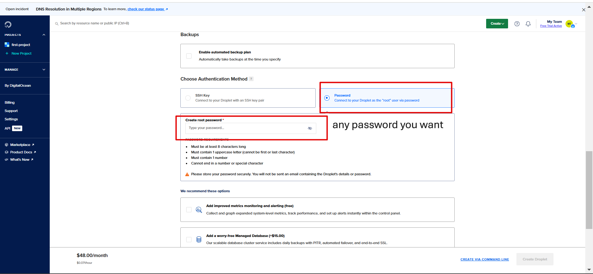
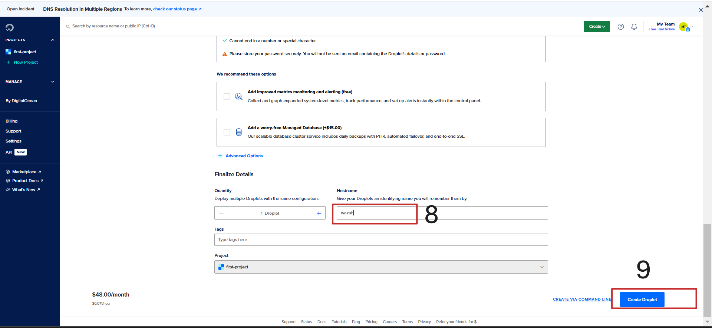
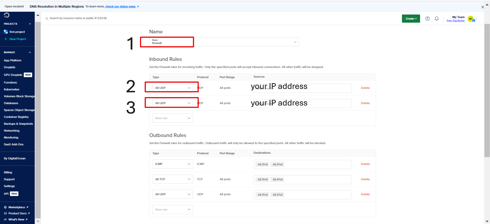
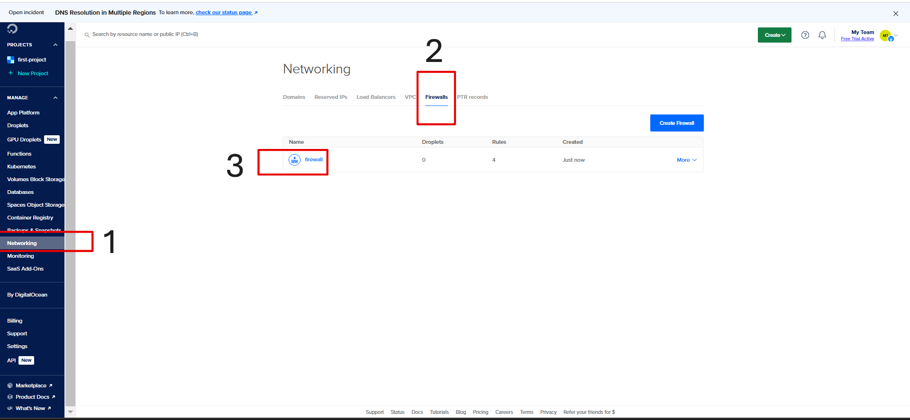
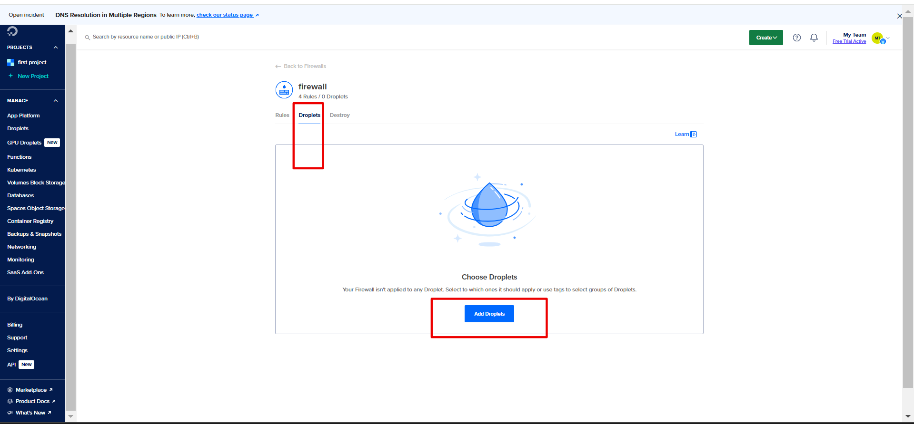
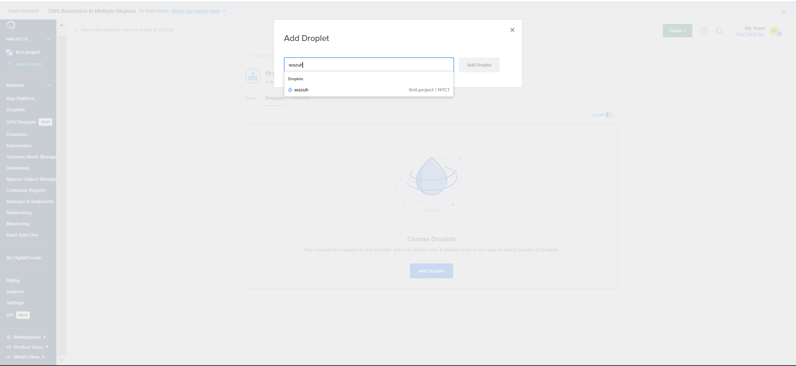

ولا قم ب انشاء حساب على digitalocen يجب وضع معلومات بطاقة بنكية ماستر كارد رايح يسحب
 مبلغ 5 دولار وتعاد للحساب بعد عشر دقائق سيتم اعطاءك رصيد مجاني بمبلغ 200 دولار لمدة 60 يوم

بعد الدخول الى حسابك على digitalocen قم بالاتي  

بعد ذلك قم بـ اعادة كل الخطوات فقط قم بتغيير الرقم السري و الـ hostname ضعه بـ اسم thehive

ثم يجب انشاء جدار حماية لمنع أي اتصالات خارجية واضافة كل من  wazuh and thehive
 كالاتي:

بعد ذلك قم بـ الدخول على صفحة موجه الأوامر في جهازك وكتابة 
ssh root@0.0.0.0 
ضع ال IP addres الخاص ب wazuh or thehive بدلا من الصفر سيطلب منك الرقم السري الذي وضعته اثناء انشاء Droplets

  بعد الدخول لكي تتمكن من التثبيت والتعديل ستجد جميع أوامر التنزيل مرفقة في الملفات 
